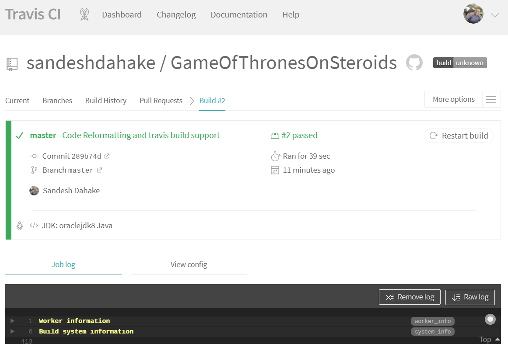

# Game Of Thrones on steroids 

**Winter is here !!!**

Software requirements: 
- JAVA 8 
- Command line

-_**Build Game**_

`mvn clean package`

-_**Run Game**_

`java -jar got-1.0-SNAPSHOT-jar-with-dependencies.jar`

-_**Bugs**_

-_**Documentation**_

Design Patterns used
- Command pattern
- Factory pattern
- Singleton pattern
- DI

Test Coverage 
- 82% coverage 
- TDD is followed in most of the part except singleton and Scanner inputs

Save Game 
- For saving game use 'save game'

Add new weapon 

1. Create new weapon class implementing  com.sandeshdahake.game.weapons.IWeapon interface
2. Add corresponding entry in  com.sandeshdahake.game.weapons.WeaponFactory class 

Add new location on MAP

1. Create new Location subclass 
2. Create corresponding Command class 
3. Add entry of new Command class to MapSetupStep.class

CI/CD 
-  Travis CI build 
 - gotOnSteroids.travis.yml

